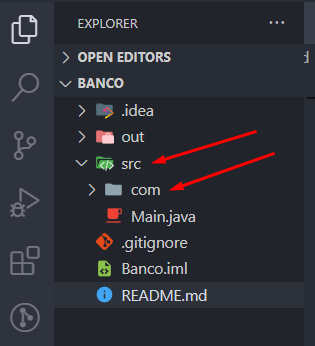

# Santander-bootcamp-2024 :rocket:

***
>_**O DESAFIO**_ :cyclone:

***


```
1. O Desafio pede uma solução simples para receber dados de um usuario e imprimir na tela os mesmos;   
```

```
2. Seguindo a tabela para criar a classe "ContaTerminal.java";
```

| Atributo | Tipo    | EXEMPLO   |
|----------|---------|-----------|
| Numero   | Inteiro | 1021      |
| Agencia  | Texto   | 067-0     |
| Nome Cli | Texto   | USER_name |
| Saldo    | Decimal | 237.48    |

```
3.Receber os dados via terminal e mostrar os mesmo em tela;
```
***

## MINHA SOLUÇÃO :zap:

***

>Criei um pacote "com.conta.banco" na pasta SRC do meu  projeto;




>Adicionando a classe "Conta.java" para armazenar e modificar os dados do usuario;


>Adicionando a classe "Dados.java" para receber e imprimir os dados do usuario;

>

>A classe "Conta.java" é construida através de seu construtor

>

> Seus Dados são acessados através dos getters e setters

> 

***
>A classe "Dados.java" possui três metodos;

*Primeiro metodo* :black_joker:


>Recebe dados via classe Scanner que converte em inteiro os dados armazenados em sua repectivas variaveis;


*Segundo e terceiro metodos* :black_joker:


>O metodo "saldoCliente" retorna apenas um saldo pré detrminado no própio código;

>O metodo "printUser" imprime os dados inseridos ou modificados em "Conta.java";


***
## Executando o Projeto :speedboat:
***

> Finalmente instanciamos um objeto do tipo "Dados" e chamamos seus metodos para realizara as operações requesitados;


> O usuario inseriu os dados e tem o retorno dos dados digitados junto com o saldo pré determinado no código;

 


***
## CONCLUSÃO :white_check_mark:
***

>Encapsular codigo é fundamental para rodar um código na "Main", muito mais limpo e seguro;

***
## FERRAMENTAS E TECNOLOGIAS UTILIZADAS :dragon_face:
***


***
## VAMOS NOS CONECTAR? :alien:


>
[My GitHub](https://github.com/rafaelrss41)

>__**Contribua com  suas ideias para este projeto!**__ :rocket: